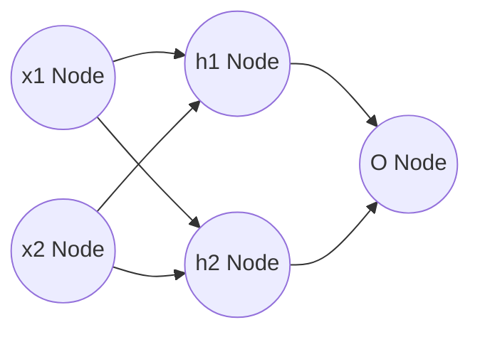

# MLP-framework

**Nodes** :
x = input,
h = hidden, 
o = output

### Formular

Node = x.w + b

Inputs  : [ x1, x2 ... xn ] 

Weights : [ w1, w2 ... wj ] 

Output  : [ x1.[ w1, w2 ... wj ], x2.[ w1, w2 ... wj ] ... xn.[ w1, w2 ... wj ] ]

